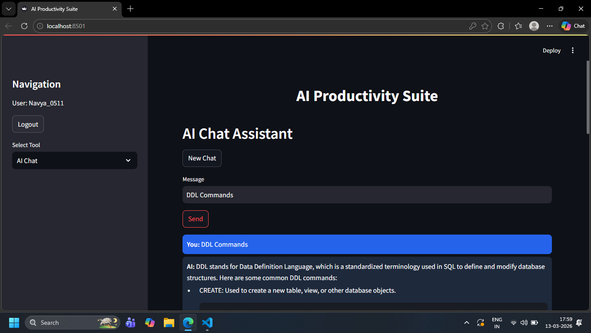
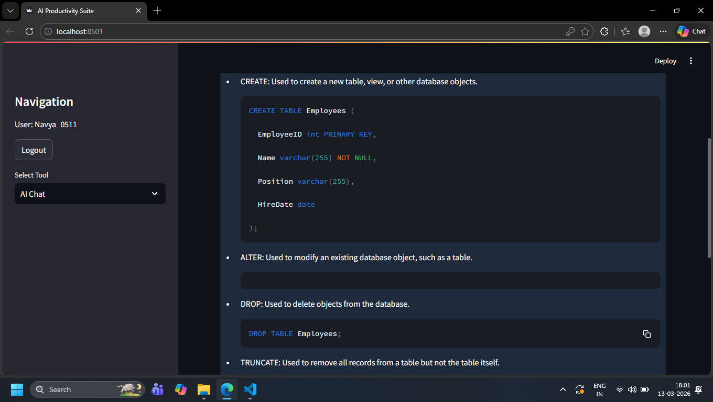
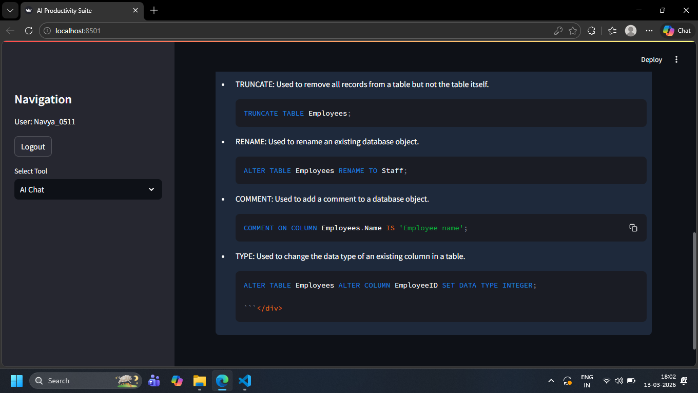
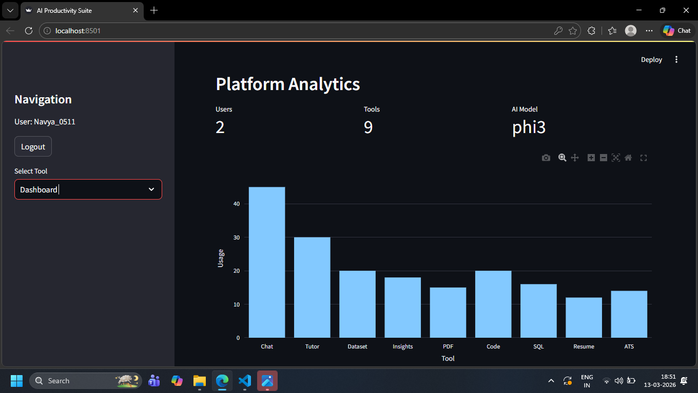

# 🎓 AI Study Assistant Ultimate

AI Study Assistant Ultimate is an AI-powered productivity and learning platform built using **Python**, **Streamlit**, and **Ollama**.  
The application provides tools for learning, data analysis, resume evaluation, document understanding, and AI-based assistance.

This project demonstrates how **AI can be integrated with data analytics tools to build intelligent applications**.

---

# 🚀 Features

## 🤖 AI Chat Assistant
- Chat with an AI model locally
- Ask questions about any topic
- Maintains chat history

## 🎓 AI Tutor
- Explains concepts clearly
- Helps with exam preparation and learning
- Generates structured explanations

## 📊 Dataset Analyzer
- Upload CSV datasets
- View dataset preview and statistics
- Generate interactive visualizations

## 📈 AI Data Insights
- Automatically generate insights from datasets
- Identify trends and patterns

## 📄 PDF Question Answering
- Upload PDF documents
- Ask questions based on document content

## 📑 Resume Analyzer
- Upload resume files
- Get AI-based feedback
- Suggestions for improving resume quality

## 🎯 ATS Resume Checker
- Generates ATS compatibility score
- Detects missing keywords
- Suggests improvements

## 💻 Code Generator
- Generate code automatically
- Supports multiple programming languages

## 🗄 SQL Query Generator
- Convert natural language tasks into SQL queries

## 📊 Dashboard
- Displays platform analytics
- Visualizes tool usage

---

# 🛠 Tech Stack

This project uses the following technologies:

- Python
- Streamlit
- Ollama
- Phi3 Large Language Model
- Pandas
- Plotly
- PyPDF2
- Requests

---

# 📂 Project Structure

```
AI-Study-Assistant-Ultimate
│
├── app.py
├── requirements.txt
├── users.json
├── README.md
└── screenshots
```

---

# ⚙️ Installation and Setup

Follow these steps to run the project locally.

## 1️⃣ Clone the Repository

```
git clone https://github.com/navyasri0511-git/AI-Study-Assistant-Ultimate.git
```

## 2️⃣ Navigate to the Project Folder

```
cd AI-Study-Assistant-Ultimate
```

## 3️⃣ Install Dependencies

```
pip install -r requirements.txt
```

## 4️⃣ Install Ollama Model

```
ollama pull phi3
```

## 5️⃣ Start Ollama

```
ollama run phi3
```

## 6️⃣ Run the Application

```
streamlit run app.py
```

## 7️⃣ Open the Application

Open the following link in your browser:

```
http://localhost:8501
```

---

# 📸 Screenshots

## AI Chat Assistant







---

## Dashboard



---

## Dataset Analyzer


---

## Resume Analyzer


---

## ATS Resume Checker


---

# 🎯 Use Cases

This project can be used for:

- AI-powered learning assistant
- Resume analysis for job seekers
- Dataset exploration and visualization
- Document understanding
- Code and SQL generation
- AI productivity tools

---

# 📈 Future Improvements

Possible improvements for this project:

- Multi-user authentication system
- Cloud deployment
- Voice-based AI assistant
- Real-time AI response streaming
- Integration with external APIs

---

# 👩‍💻 Author

Navya  

GitHub Profile:  
https://github.com/navyasri0511-git

---

# ⭐ Support

If you found this project helpful, please consider **starring the repository**.

It helps others discover the project and motivates further development.
